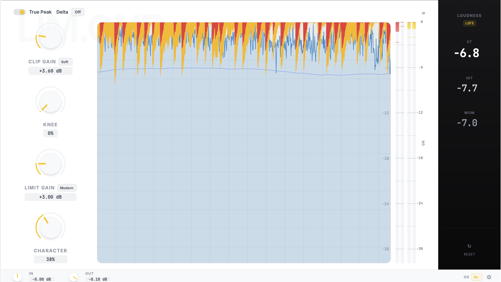

# Lim.one

A high-performance, two-stage loudness processor plugin (Clipper + Limiter) designed for mixing and mastering.



## Features

- **Two-Stage Processing**:
  - **Clipper**: Soft/Hard clipping with adjustable knee and drive.
  - **Limiter**: Dual-mode (Classic/Modern) limiting with Lookahead and True Peak detection.
- **Modern Limiter Engine**:
  - Advanced envelope control (Attack, Release, Hold).
  - Adaptive release behavior based on transient detection.
  - Stereo linking controls.
- **High-Quality DSP**:
  - Up to 16x Linear Phase Oversampling.
  - True Peak limiting for inter-sample peak safety.
  - Delta monitoring to hear exactly what is being removed.
- **Visualization**:
  - Real-time gain reduction metering for both stages.
  - Integrated LUFS loudness metering (Short-term, Momentary, Integrated).
  - Waveform display with adjustable range and speed.

## Release Management

This project includes an automated release management system. See [QUICKSTART.md](QUICKSTART.md) for quick start guide.

**Quick commands:**
```bash
./release.sh                         # Interactive menu
./scripts/release-quick.sh full      # One-click release
```

📚 **Documentation:**
- [QUICKSTART.md](QUICKSTART.md) - 30 second quick start
- [docs/release/RELEASE-README.md](docs/release/RELEASE-README.md) - Complete guide
- [docs/release/RELEASE-CHEATSHEET.md](docs/release/RELEASE-CHEATSHEET.md) - Command reference
- [docs/release/VERSION-SYNC.md](docs/release/VERSION-SYNC.md) - Version management

## Building

This project uses CMake and JUCE 7.

### Prerequisites

- CMake 3.15 or higher
- C++17 compatible compiler
- [JUCE Framework](https://github.com/juce-framework/JUCE) (included in `Limone/JUCE`)

### Build Steps

1. Clone the repository:
   ```bash
   git clone https://github.com/yourusername/Lim.one.git
   cd Lim.one
   ```

2. Configure and build:
   ```bash
   # Create build directory
   mkdir build && cd build
   
   # Configure with CMake
   cmake ..
   
   # Build
   cmake --build . --config Release
   ```

3. The built plugin binaries (VST3, AU, AAX, Standalone) will be in the `Limone_artefacts` directory.

### AAX Support

The AAX SDK is proprietary and cannot be included in this repository. To build the AAX version:
1. Download the AAX SDK from Avid.
2. Place it in `SDKs/aax-sdk-2-9-0`.
3. Re-run CMake.

## License

GNU GENERAL PUBLIC LICENSE
Version 3, 29 June 2007

Copyright (C) 2007 Free Software Foundation, Inc. <https://fsf.org/>
Everyone is permitted to copy and distribute verbatim copies
of this license document, but changing it is not allowed.

Preamble

The GNU General Public License is a free, copyleft license for
software and other kinds of works.

(Note: This is a placeholder. Please replace with the full text of the GPLv3 license or your chosen license.)

## Contributing

Contributions are welcome! Please feel free to submit a Pull Request.
